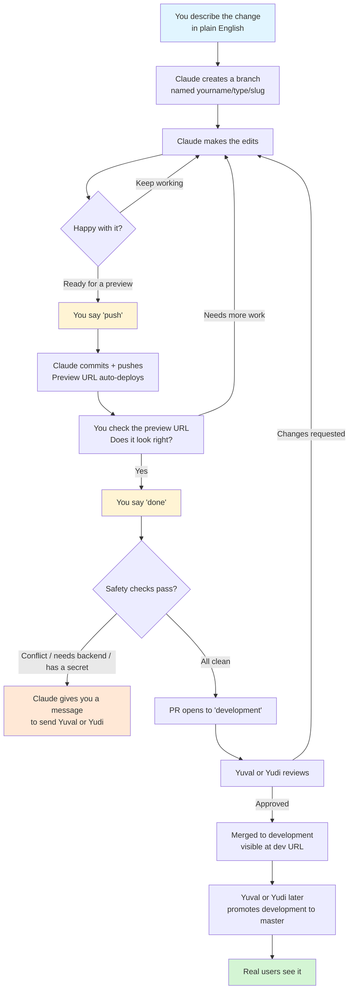

# Contributing to UNITISM's apps — a primer for Asad and Kath

Welcome. This is the short version of how you ship changes to the apps — `arenna-link`, `tennis-miami`, and `tennis-miami-web` — without having to learn git.

You don't need to read all of this at once. Read the first section today, bookmark the rest for when you hit a word you don't recognize.

---

## The mental model (four ideas)

**1. Your branch is your safe space.**
When you tell Claude what you want to change, it makes a private copy of the app (a "branch") with your name on it — like `asad/feat/new-button`. Everything you do happens on that branch. Pushing to it is safe: it only deploys to a private preview URL that nobody else is watching. Real users only see what's on `master`, and only Yuval or Yudi promote work there. **You cannot accidentally break the live app.** Iterate as much as you want.

**2. You describe. Claude does the typing.**
You say what you want in plain English — *"change the signup button color to navy"*, *"fix the dropdown on the booking form"*, *"rewrite the homepage hero to say X instead of Y."* Claude makes the edits in the code. You don't need to look at the code unless you want to.

**3. Three keywords run everything.**
`push`, `done`, `revert`. That's it. You'll learn what each one does below.

**4. When something can't be safely done by you alone, Claude tells you.**
If your change needs engineering work (like a new API endpoint from the backend), Claude will STOP and give you a ready-to-send message to forward to Yuval or Yudi. You never get stuck guessing.

---

## Getting started — your first session

### One-time setup

**Already done by Yuval:**

- Claude desktop app is installed on your computer.
- Three repos are cloned to `C:\Dev\arenna-link`, `C:\Dev\tennis-miami`, and `C:\Dev\tennis-miami-web` (Windows) or `~/Dev/arenna-link`, etc. (Mac).

**You need to do this once — install the contribution skill.**

Without this step, Claude won't know any of the keywords (`push`, `done`, `revert`) and will behave like a generic chatbot. It takes 30 seconds.

> Before running the commands below, make sure Yuval has told you the `unitism-skills` repo is ready on GitHub. If he hasn't, wait — it won't exist yet.

**On Windows** — open PowerShell (search "PowerShell" in the Start menu) and paste this:

```powershell
$src = "C:\Dev\unitism-skills"
$dst = "$env:USERPROFILE\.claude\skills"

if (!(Test-Path $src)) {
    git clone https://github.com/YuvalKlein/unitism-skills.git $src
}
cd $src; git pull

New-Item -ItemType Directory -Path $dst -Force | Out-Null
Copy-Item -Recurse -Force "$src\non-engineer-frontend-contribution" $dst
Write-Host "Skill installed. Restart Claude desktop."
```

**On Mac** — open Terminal (press Cmd+Space, type "Terminal") and paste this:

```bash
SRC=~/Dev/unitism-skills
DST=~/.claude/skills

mkdir -p ~/Dev "$DST"
if [ ! -d "$SRC" ]; then
    git clone https://github.com/YuvalKlein/unitism-skills.git "$SRC"
fi
cd "$SRC" && git pull

cp -rf "$SRC/non-engineer-frontend-contribution" "$DST/"
echo "Skill installed. Restart Claude desktop."
```

Then **quit and reopen Claude desktop** (fully close it, don't just minimize).

**To check the skill is loaded:** open Claude, start a new chat, select one of the `Dev\` repo folders, type *"hello, are you loading any UNITISM skills?"*. Claude should mention `non-engineer-frontend-contribution`. If it doesn't, send the error (or lack of response) to Yuval.

**When Yuval tells you there's an update to the skill,** re-run the exact same command block above. It pulls the latest and overwrites.

### Every time you want to make a change:

1. **Open the Claude desktop app.**
2. **Start a new chat.**
3. **Select the folder for the app you want to change.** Use Claude's folder picker and pick the right one:
   - Changing the **Tennis Miami website** (landing page, admin panel)? → `C:\Dev\tennis-miami-web`
   - Changing **ARENNA** (the app at arenna.link)? → `C:\Dev\arenna-link`
   - Changing the **Tennis Miami mobile app**? → `C:\Dev\tennis-miami`
   - Not sure? Ask Yuval.
4. **Type what you want to change in plain English.** For example: *"I want to change the color of the signup button to navy on the landing page."*
5. **Claude takes it from there.** As it works, you'll use `push`, `done`, and `revert` as needed (keywords explained below).

> **Important:** if you open Claude without picking a repo folder, the skill won't trigger and Claude will behave like a generic chatbot. Always select the folder for the repo you want to change **before** typing your request.

---

## The flow



---

## The three keywords

### `push`
*"Commit what I have and put it on GitHub so I can see it running."*

Claude does two things in one: writes a commit message describing your changes, and pushes the branch to GitHub. A preview URL auto-builds in ~1 minute — a real web address where you can see your changes running, visible only to you and the team. You can share that preview link with Yuval, Yudi, or even a customer for early feedback. No human review starts yet — review only starts when you say `done`. So push as often as you want; it's the equivalent of saving your work and pressing "refresh preview."

### `done` (or `PR`)
*"I'm ready for review — open a pull request."*

This is the biggest one. Claude does five things in order:

1. **Catches up with other changes.** If Yuval or Yudi merged something to the shared `development` branch while you were working, your branch has to be updated to match. If it can be done automatically, Claude does it. If it can't, Claude gives you a message to send them.
2. **Scope check.** Claude looks at what you changed. If you started out changing a button color but your branch now also touches six other unrelated things, Claude will suggest splitting it — small focused changes are much faster to get reviewed than big mixed-bag ones.
3. **Out-of-scope check.** Claude checks whether your change needs something from the backend (which is engineering territory). If it does, Claude STOPS and gives you a ready-to-send message for Yuval or Yudi. Forward it to them. They'll handle the backend part, then tell you to run `done` again.
4. **Secret check.** Claude makes sure no passwords, API keys, or secrets sneaked into your changes. If anything suspicious is there, it halts and tells you what it found.
5. **Opens the PR.** A pull request (PR) is a formal request to merge your work into the shared `development` branch. Yuval or Yudi will review. First one to look at it, approves it.

### `revert`
*"The thing I just shipped caused a problem — undo it."*

Only works on your own merges. If you merged something to `development` yesterday and today Yuval tells you it broke something, say `revert` and Claude will undo it. Your work isn't lost — it's still on your branch, and you can try again after fixing whatever broke.

---

## Preview URLs — where your work lives before it's real

Every branch you push gets its own preview web address, automatically.

| Repo | Preview URL pattern |
|------|---------------------|
| `arenna-link` | `https://arenna--<channel-slug>.web.app` — Firebase Hosting preview channel (needs to be wired into `deploy.sh` or CI; until then, ask Yuval or Yudi to run the channel deploy) |
| `tennis-miami-web` | `https://tennis-miami-web-<branch-slug>.vercel.app` (once Vercel per-branch previews are enabled) |
| `tennis-miami` | *Flutter app — preview is a dev build; ask Yudi for the TestFlight / APK link* |

Claude will post the preview URL in your PR and also tell you the address when it's ready. **Always open the preview URL and eyeball your change before saying `done`.** That one habit catches 80% of visual issues before a human reviewer has to look.

When your PR is merged to `development`, it becomes visible at the shared dev URLs:
- `dev.tennismiami.app` (public dev site)
- `admin-dev.tennismiami.app` (dev admin panel)
- *ARENNA dev URL — to be confirmed*

The shared dev URLs are where Yuval or Yudi verify the combined work of everyone's PRs. That's the last step before changes go to real users.

---

## "What if I break something?"

You can't break the live app. The branching flow makes it structurally impossible for anything you do on your own to reach real users without Yuval or Yudi approving first.

What *can* happen, and what to do:

- **You tried something and it looks wrong on the preview URL.** No problem — keep working. Ask Claude to change it back, or try a different approach; then `push` again and a new preview URL will build. Your branch is private; no human review starts until you say `done`.
- **You got a merge conflict message.** Don't try to resolve it yourself. Send the message Claude gave you to Yuval or Yudi.
- **Claude said you need a backend change.** Copy the whole message it gave you and send it to Yuval or Yudi via chat. Do **not** try to make the change yourself in another repo — you don't have access, and the whole point of the message is to let them do it safely. When they tell you it's done, come back and say `done` again.
- **You merged something and then realized it's wrong.** Say `revert`. No damage done — `development` goes back to how it was before your PR, and real users haven't seen anything (real users only see what's on `master`, and Yuval or Yudi promote things there deliberately).
- **Something weird happened that's not in this list.** Stop, take a screenshot, send it to Yuval or Yudi. That's always the right move when in doubt. You're never in trouble for asking.

---

## When to ask a human (not Claude)

Always ask Yuval or Yudi directly, not Claude, when:

- You're not sure whether a change is a good idea product-wise — Claude will happily build whatever you ask, so product judgment belongs with humans.
- You want to change something outside `arenna-link`, `tennis-miami`, or `tennis-miami-web` — those are the only repos you have access to right now.
- A client is waiting and the PR is taking too long to review — ping in chat.
- Claude is suggesting something that feels risky or that you don't understand — you're not expected to know when Claude is wrong, but if your gut says "this might break things," trust it and ask.

---

## Glossary (the words you'll see)

- **Repo** — a folder of code for one app. You have access to three: `arenna-link`, `tennis-miami`, `tennis-miami-web`.
- **Branch** — a named copy of the code. Yours are named like `asad/feat/signup-button-color`. Think of it as your private workspace.
- **`development`** — the shared branch where everyone's approved work lives. Visible at the dev URLs. Not yet seen by real users.
- **`master`** — the branch that real users see. Only Yuval or Yudi promote things here, and only deliberately.
- **Commit** — a saved snapshot of your work. Every `push` creates one (Claude writes the commit message automatically from your changes).
- **Push** — upload your branch to GitHub so others can see it.
- **PR (pull request)** — a formal request to merge your branch into `development`. Yuval or Yudi review and approve.
- **Merge** — when a PR is approved, your branch's changes get added to `development`.
- **Rebase** — updating your branch to include the latest changes from `development`. Claude does this automatically on `done`.
- **Conflict** — when two people changed the same line differently. You don't resolve these; an engineer does.
- **Preview URL** — a private web address where your branch is live for you to test before review.

---

If anything here is confusing, ask Yuval. The doc will get clearer with every question you raise.

---

## Appendix — cloning a repo (for new teammates)

*You don't need this if Yuval already set you up. Keep it for reference if you join the team later and need to get things from scratch.*

1. **Get GitHub access.** Ask Yuval or Yudi to add your GitHub account to the organization that owns these repos. Without this step, cloning will fail with "repository not found."

2. **Install Git for Windows** if it's not already installed: https://git-scm.com/download/win. Accept the defaults during install.

3. **Open PowerShell** (search "PowerShell" in the Start menu) and run:

   ```
   if (!(Test-Path C:\Dev)) { New-Item -ItemType Directory -Path C:\Dev }
   cd C:\Dev
   git clone https://github.com/YuvalKlein/tennis-miami-web.git
   git clone https://github.com/YuvalKlein/tennis-miami.git
   git clone https://github.com/YuvalKlein/arenna-link.git
   ```

4. **Tell Yuval or Yudi the clone finished** so they can install the contribution skill on your Claude. After that, you're ready — open Claude, pick one of the `C:\Dev\` folders, and describe your first change.

If any of the clones fail, show the error message to Yuval or Yudi. Don't try to fix it yourself.
